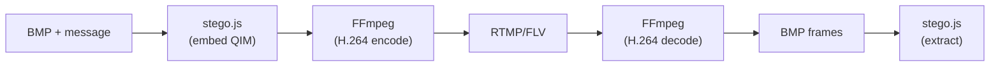
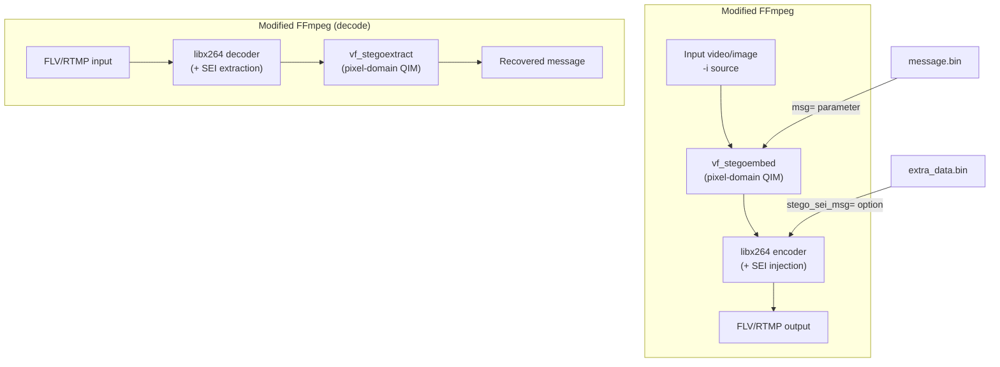

# Plan: Модификация FFmpeg для стеганографии максимальной ёмкости

## Текущее состояние проекта

Проект `rtmp-push` уже реализует стеганографию через QIM (Quantization Index Modulation) в зелёном канале BMP-кадров ([stego.js](rtmp-push/stego.js)), но с ограничениями:

- Используется только 1 из 3 цветовых каналов
- Блоки 8x8 пикселей с 3-кратным повторением (REPS=3) для надёжности
- Только ~90% блоков используется (UTILIZATION=0.9)
- Для 1920x1080: ~7-8 КБ полезной нагрузки на кадр

Текущий pipeline:



## Выбранный подход: Три уровня встраивания данных

Поскольку сохранность видеоинформации не важна, а нужен лишь валидный видеопоток -- используем ВСЕ доступные каналы видеоконтейнера.

### Уровень 1: Custom FFmpeg filter `stegoembed` / `stegoextract` (pixel-domain)

Модификация FFmpeg добавлением двух видеофильтров в `libavfilter/`:

**Фильтр встраивания (`vf_stegoembed.c`):**

- Работает в YUV420p (нативный формат H.264 pipeline)
- Использует ВСЕ 3 канала (Y, U, V) -- Y полноразмерный, U/V в четверть разрешения
- Многоуровневое QIM (не бинарное): кодирование 3-4 бит на пиксель Y и 2-3 бит на U/V
- Параметры: путь к файлу сообщения, номер/количество чанков, шаг квантования, уровень FEC
- Встроенный Reed-Solomon FEC для коррекции ошибок после H.264 сжатия
- Заголовок кадра: magic (4B) + chunk_index (2B) + total_chunks (2B) + chunk_len (4B) + CRC32 (4B)

**Фильтр извлечения (`vf_stegoextract.c`):**

- Обратная операция: читает QIM-кодированные значения из YUV пикселей
- Мажоритарное голосование для повышения надёжности
- Коррекция RS-ошибок
- Вывод восстановленных данных в файл

**Оценка ёмкости (1920x1080, все каналы, 3 бита/пиксель Y, 2 бита/пиксель UV):**

- Y: 1920 x 1080 x 3 бит = ~777 КБ
- U: 960 x 540 x 2 бит = ~130 КБ
- V: 960 x 540 x 2 бит = ~130 КБ
- Итого "сырая" ёмкость: ~1 МБ/кадр
- С FEC overhead (~30%) и заголовками: ~700 КБ/кадр
- При 30fps: ~~21 МБ/с -- рост в **100x** по сравнению с текущим stego.js (~~7 КБ/кадр)

### Уровень 2: SEI NAL unit injection (bitstream-level)

Модификация `libavcodec/libx264.c` (обёртка x264 в FFmpeg):

- Инъекция данных в SEI (Supplemental Enhancement Information) User Data Unregistered NAL units
- SEI поля сохраняются при re-muxing (но не при re-encoding)
- Дополнительная ёмкость: до ~64 КБ на NAL unit, несколько NAL units на кадр
- Используется как дополнительный канал к pixel-level стеганографии
- Новая опция: `-x264opts stego_sei_msg=path/to/extra_data.bin`

### Уровень 3: Оптимальные настройки H.264 для максимальной сохранности QIM

Не модификация кода, а набор рекомендованных параметров кодирования:

- `-crf 0` или `-qp 0` для lossless mode (полная сохранность пикселей)
- При необходимости lossy: `-crf 10 -preset ultrafast` (минимальные искажения)
- `-tune grain` (сохраняет высокочастотные детали, которые содержат QIM-данные)
- `-x264-params deblock=0:0` (отключение деблокинг-фильтра, который смазывает QIM)
- `-g 1` (каждый кадр -- keyframe, для независимого декодирования чанков)

## Архитектура модификации FFmpeg



## CLI-интерфейс (вызов из внешних приложений)

**Встраивание (encode):**

```bash
ffmpeg -loop 1 -i carrier.bmp \
  -vf "stegoembed=msg=secret.bin:chunk=0:chunks=5:fec=rs28" \
  -c:v libx264 -crf 0 -g 1 -preset ultrafast \
  -f flv rtmp://localhost:1935/live/test
```

**Извлечение (decode):**

```bash
ffmpeg -i rtmp://localhost:1935/live/test \
  -vf "stegoextract=out=recovered.bin:fec=rs28" \
  -f null -
```

**Для rtmp-push интеграции** -- вызов из Node.js:

```javascript
const ffmpeg = spawn("ffmpeg", [
  "-loop",
  "1",
  "-i",
  "carrier.bmp",
  "-vf",
  `stegoembed=msg=${msgPath}:chunk=${i}:chunks=${total}`,
  "-c:v",
  "libx264",
  "-crf",
  "0",
  "-g",
  "1",
  "-f",
  "flv",
  "pipe:1",
]);
```

## Файловая структура модификаций FFmpeg

Все изменения в клонированном репозитории FFmpeg:

- `libavfilter/vf_stegoembed.c` -- фильтр встраивания (новый файл, ~400-500 строк C)
- `libavfilter/vf_stegoextract.c` -- фильтр извлечения (новый файл, ~300-400 строк C)
- `libavfilter/Makefile` -- регистрация фильтров (2 строки)
- `libavfilter/allfilters.c` -- регистрация фильтров (2 строки)
- `libavcodec/libx264.c` -- SEI injection (патч ~50-80 строк)

## Интеграция с rtmp-push

Обновление проекта [rtmp-push](rtmp-push/):

- Обновить [image-source.js](rtmp-push/image-source.js) -- заменить вызов `stego.js` `embedChunk()` на передачу параметра `stegoembed` через ffmpeg `-vf`
- Обновить [decode.js](rtmp-push/decode.js) и [local-receive.js](rtmp-push/local-receive.js) -- добавить `-vf stegoextract=...` в аргументы ffmpeg
- Добавить скрипт `build-ffmpeg.sh` -- клонирование FFmpeg, наложение патчей, сборка
- Обновить [stego.js](rtmp-push/stego.js) -- сохранить как fallback, но добавить экспорт параметров для нативных фильтров

## Порядок реализации

Реализация идёт инкрементально: каждый этап приносит конкретный результат.
